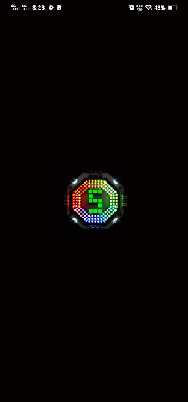
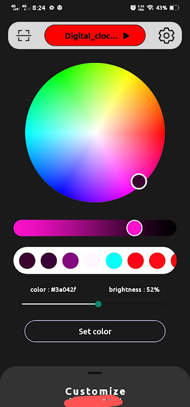
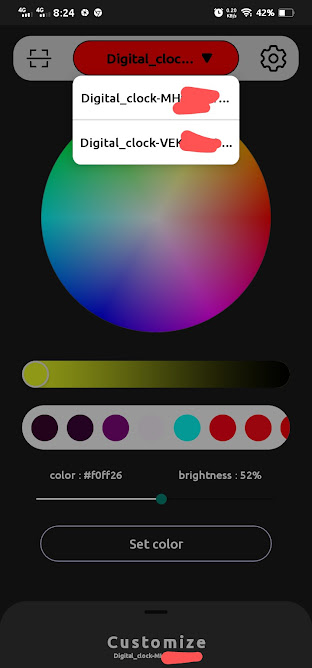
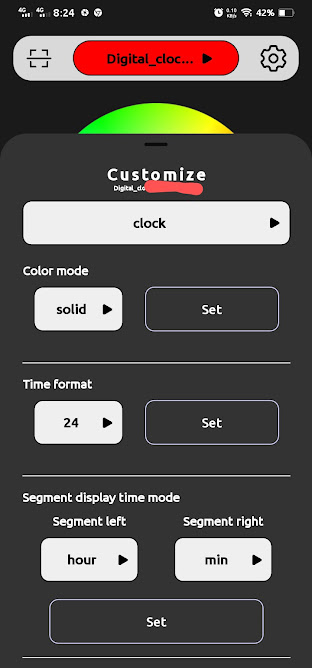
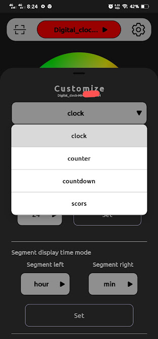
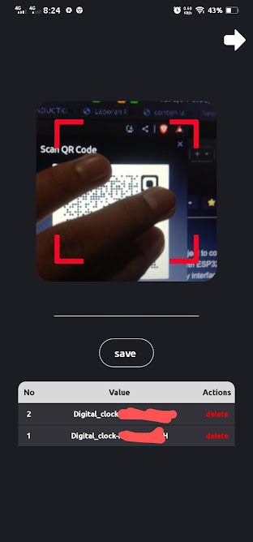
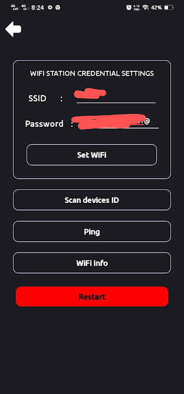

This application is dedicated to the IoT project [digital clock.](https://github.com/yopaaa/digital-clock-ws1228b.git)

To download apk see [this](https://github.com/yopaaa/digital-clock-ws1228b-app/releases)

# Demo UI

>eas build -p android --profile preview
